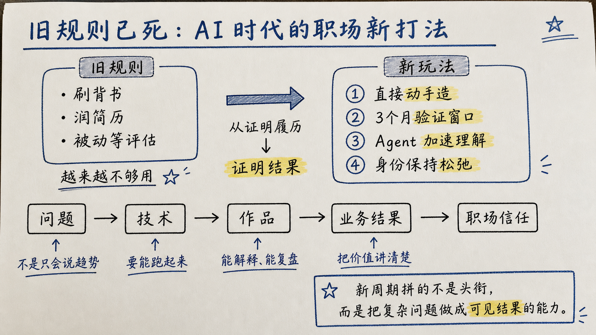
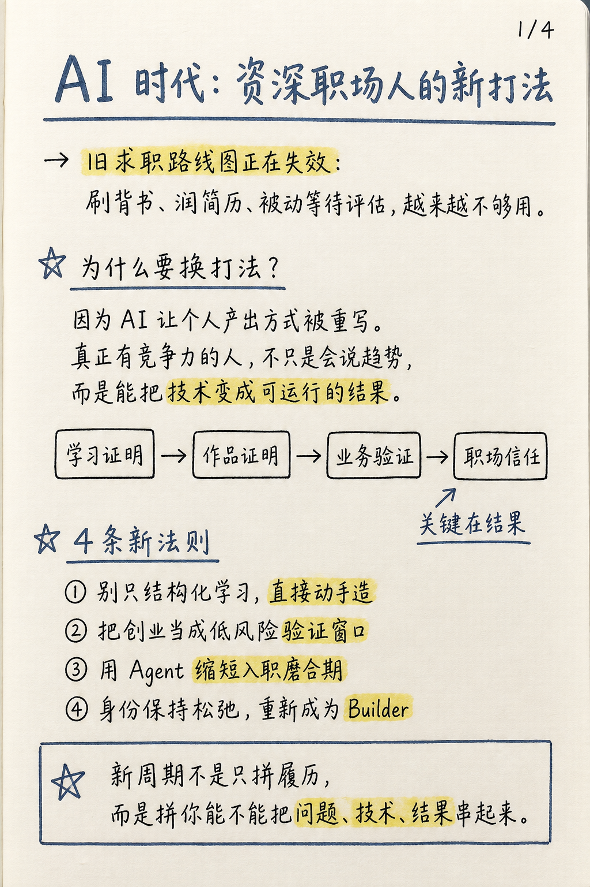

# Lifang Illustration Styles

中文 | [English](./README.en.md)

这是一个私人插图风格库 Skill，用于让 Codex / 支持 Agent Skills 的本地智能体根据文章内容自动选择插图风格，并生成更稳定、更接近参考图的提示词。

当前包含一个 Skill：

```text
skills/personal-illustration-styles/
```

它会把不同插图风格沉淀成可复用的 style card。以后看到新的好看图片，可以继续把新风格补充进这个 Skill。

## 当前风格

| 风格 | 适合内容 | 特征 |
|---|---|---|
| Hand-drawn knowledge comic | 中文知识卡片、AI/职场观点、流程解释、社媒长图 | 暖米色纸张、抖动黑线、彩铅、火柴人、便利贴、橙色波浪强调 |
| Colorful AI whiteboard infographic | LLM/RAG/Agent/MCP、AI 技术科普、架构图、课程讲义 | 白底、粗马克笔标题、彩色分栏、机器人讲解员、技术图标、高密度白板海报 |
| Warm handdrawn card series | 中文文章卡片、小红书/社媒知识卡、AI/职场/产品观点 | 暖纸底、大号手写标题、橙色关键词、页码角标、圆角编号卡片、底部金句 |
| Warm handdrawn blog illustration | 博客头图、公众号/知乎/CSDN 正文横图、文章段落配图 | 16:9 暖纸横图、手绘标题、中心隐喻场景、轻量标签和箭头、无页码角标 |
| Handwritten lecture notes landscape | 博客文章横图、工作坊讲义、横向对比图、旧/新规则解释 | 16:9 米白纸、蓝灰手写标题、黑色笔记文字、黄色重点、框图箭头、右上角不写格式标签 |
| Handwritten lecture notes portrait | 竖版长页讲义、中文解释页、步骤拆解、学习笔记 | A4 感米白纸、蓝灰标题、黑色手写正文、黄色重点、流程框、旁注、底部总结 |

## 效果预览

### Hand-drawn knowledge comic

| 饱满知识漫画版 | 低密度简版 |
|---|---|
|  |  |

### Colorful AI whiteboard infographic

| AI 系统演进总览 | 知识工作者 Codex 指南 |
|---|---|
|  |  |

| 工作流库示例 | MCP 阶段讲义 |
|---|---|
|  |  |

### Warm handdrawn card series

| AI 职场新法则卡片 |
|---|
|  |

### Handwritten lecture notes

| 横版手写讲义 | 竖版手写讲义 |
|---|---|
|  |  |

## 安装

### 方式一：手动安装到 Codex

克隆仓库：

```bash
git clone https://github.com/STRUGGLE1999/lifang-illustration-styles.git
```

macOS / Linux：

```bash
mkdir -p ~/.codex/skills
cp -R lifang-illustration-styles/skills/personal-illustration-styles ~/.codex/skills/
```

Windows PowerShell：

```powershell
New-Item -ItemType Directory -Force -Path "$env:USERPROFILE\.codex\skills" | Out-Null
Copy-Item -Recurse -Force ".\lifang-illustration-styles\skills\personal-illustration-styles" "$env:USERPROFILE\.codex\skills\personal-illustration-styles"
```

重启 Codex 或开启新会话后，即可使用：

```text
使用 $personal-illustration-styles，根据这篇文章选择合适插图风格并生成配图提示词。
```

### 方式二：使用 skills CLI（如果你的环境支持）

```bash
npx skills add STRUGGLE1999/lifang-illustration-styles
```

如果你的 skills CLI 只支持单 Skill 目录安装，请改用方式一。

## 使用示例

```text
使用 $personal-illustration-styles，阅读这篇文章，判断适合哪种插图风格，并生成一张配图。
```

```text
使用 $personal-illustration-styles 的 hand-drawn knowledge comic 风格，为这篇 AI 效率文章生成一张饱满知识漫画版插图。
```

```text
使用 $personal-illustration-styles 的 colorful AI whiteboard infographic 风格，为这篇 LLM/RAG/Agent/MCP 技术文章生成演进对比海报。
```

```text
使用 $personal-illustration-styles 的 handwritten lecture notes landscape 风格，为这篇职场文章生成一张横版手写讲义式配图。
```

```text
使用 $personal-illustration-styles 的 handwritten lecture notes portrait 风格，为这篇文章生成一张竖版手写笔记长页。
```

## 如何继续增加新风格

1. 准备几张同一视觉方向的参考图。
2. 让 Codex 使用 `$personal-illustration-styles` 分析图片风格。
3. 新建或更新 `skills/personal-illustration-styles/references/styles/<style-slug>.md`。
4. 把参考图放到 `skills/personal-illustration-styles/assets/styles/<style-slug>/references/`。
5. 更新 `skills/personal-illustration-styles/references/style-index.md`。
6. 用真实文章生成测试图，校准到接近参考图。

## 目录结构

```text
.
├── README.md
├── README.en.md
├── LICENSE
└── skills/
    └── personal-illustration-styles/
        ├── SKILL.md
        ├── agents/
        │   └── openai.yaml
        ├── references/
        │   ├── style-index.md
        │   ├── style-card-template.md
        │   └── styles/
        └── assets/
            └── styles/
```

## 许可证

MIT License
